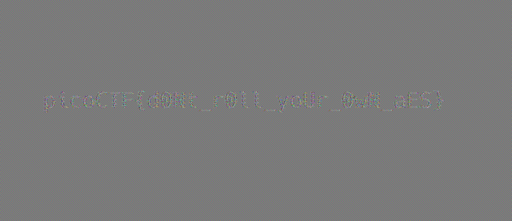

# AES-ABC

## Summary

Challenge description: AES-ECB is bad, so I rolled my own cipher block chaining mechanism - Addition Block Chaining!

The challenge implements a custom block cipher chaining mode called "Addition Block Chaining" (AES-ABC) on top of AES-ECB. The scheme attempts to fix ECB's well-known weakness by chaining ciphertext blocks together using modular addition instead of XOR. However, the addition operation is trivially invertible without knowledge of the key, exposing the underlying AES-ECB ciphertext. Since AES-ECB preserves plaintext structure (identical plaintext blocks encrypt to identical ciphertext blocks), the flag becomes visible in the recovered ECB ciphertext when interpreted as an image.

**Artifacts:**

- `aes-abc.py`: implementation of the vulnerable AES-ABC encryption scheme
- `body.enc.ppm`: the encrypted PPM image produced by `aes-abc.py`
- `solve.py`: Python script to recover and display the flag
- `body_ecb.ppm`: recovered AES-ECB ciphertext written as a PPM image
- `body_ecb.png`: `body_ecb.ppm` converted to PNG, containing the visible flag

## Context

The flag is stored as a [PPM (Portable Pixmap)](https://en.wikipedia.org/wiki/Netpbm) image (`flag.ppm`). PPM is a simple uncompressed image format: a plaintext header specifying width, height, and max color value, followed by raw RGB pixel bytes. The encryption script reads the pixel data, encrypts it, and writes the original header back along with the encrypted body — meaning the image dimensions are preserved in the output.

The encryption proceeds in two stages. First, the raw pixel bytes are encrypted with AES in ECB (Electronic Codebook) mode:

```python
cipher = AES.new(KEY, AES.MODE_ECB)
ct = cipher.encrypt(pad(pt))
```

In ECB mode, each 16-byte block is encrypted independently. This means that any two plaintext blocks with identical content will produce identical ciphertext blocks, leaving the structure of the plaintext visible in the ciphertext.

Second, the AES-ECB ciphertext is chained with a random IV using modular addition — the "ABC" mode:

```python
iv = os.urandom(16)
blocks.insert(0, iv)

for i in range(len(blocks) - 1):
    prev_blk = int(blocks[i].encode('hex'), 16)
    curr_blk = int(blocks[i+1].encode('hex'), 16)

    n_curr_blk = (prev_blk + curr_blk) % UMAX
    blocks[i+1] = to_bytes(n_curr_blk)
```

where `UMAX = 2^128`. Denoting the ECB ciphertext blocks as $E_1, E_2, \ldots$ and the ABC output blocks (including the IV prepended as $C_0$) as $C_0, C_1, C_2, \ldots$, the chaining is:

$$C_i = (C_{i-1} + E_i) \bmod 2^{128}$$

## Vulnerability

The AES-ABC scheme has two compounding weaknesses.

**Weakness 1: The ABC chaining is invertible without the key.**

Unlike XOR-based CBC where reversing the chaining requires decrypting the ciphertext block (and thus requires the key), addition mod $2^{128}$ is trivially reversible by subtraction. Given the full ABC ciphertext (including the prepended IV as $C_0$), any ECB ciphertext block can be recovered as:

$$E_i = (C_i - C_{i-1}) \bmod 2^{128}$$

No key is required. An attacker who observes the ciphertext can fully recover the intermediate AES-ECB ciphertext.

**Weakness 2: AES-ECB preserves plaintext structure.**

Once the ECB ciphertext is recovered, it still exhibits the classic ECB weakness: identical 16-byte plaintext blocks produce identical 16-byte ciphertext blocks. A PPM image with a uniform background color has large regions of repeating pixel patterns. Those regions produce repeating ECB ciphertext blocks, and when the ECB ciphertext is rendered back as an image, the structure — including any text — is visually apparent.

This is a variant of the classic [AES-ECB penguin attack](https://words.filippo.io/the-ecb-penguin/), where an encrypted image is recognizable because ECB preserves pixel block patterns. The "ABC" chaining was intended to obscure this, but since it is invertible without the key, it provides no additional security.

This vulnerability falls under [CWE-327: Use of a Broken or Risky Cryptographic Algorithm](https://cwe.mitre.org/data/definitions/327.html).

## Exploitation

The exploit is implemented in [solve.py](./solve.py):

1. **Parse the PPM header.** The header is unencrypted and gives us the image dimensions. The encrypted body immediately follows.

   ```python
   def remove_line(data):
       idx = data.index(b'\n')
       return data[:idx + 1], data[idx + 1:]

   def parse_header_ppm(data):
       header = b""
       for _ in range(3):
           line, data = remove_line(data)
           header += line
       return header, data

   with open('body.enc.ppm', 'rb') as f:
       raw = f.read()

   header, body = parse_header_ppm(raw)
   ```

2. **Split the body into 16-byte blocks.** The first block is the IV ($C_0$), followed by the ABC ciphertext blocks.

   ```python
   BLOCK_SIZE = 16
   blocks = [body[i * BLOCK_SIZE:(i + 1) * BLOCK_SIZE] for i in range(len(body) // BLOCK_SIZE)]
   ```

3. **Recover the AES-ECB ciphertext by computing block differences.** For each consecutive pair of ABC blocks, subtract to undo the addition chaining:

   $$E_i = (C_i - C_{i-1}) \bmod 2^{128}$$

   ```python
   UMAX = int(math.pow(256, BLOCK_SIZE))

   ecb_blocks = []
   for i in range(1, len(blocks)):
       prev = int(blocks[i - 1].hex(), 16)
       curr = int(blocks[i].hex(), 16)
       ecb = (curr - prev) % UMAX
       ecb_blocks.append(ecb.to_bytes(BLOCK_SIZE, 'big'))

   ecb_body = b"".join(ecb_blocks)
   ```

4. **Write the recovered ECB ciphertext as a PPM image and open it.** The original PPM header is reused so image dimensions are correct. When rendered, identical background pixel blocks appear as identical ciphertext blocks, making the flag text visible.

   ```python
   with open('body_ecb.ppm', 'wb') as f:
       f.write(header)
       f.write(ecb_body)

   Image.open('body_ecb.ppm').save('body_ecb.png')
   ```

The resulting image reveals the flag: 

## Remediation

The fix is to replace the addition-based chaining with XOR-based chaining, which is the standard CBC (Cipher Block Chaining) mode. In CBC, each plaintext block is XORed with the previous ciphertext block before encryption:

$$C_i = E_K(P_i \oplus C_{i-1})$$

Unlike addition mod $2^{128}$, reversing the XOR chaining to recover $P_i \oplus C_{i-1}$ requires decrypting $C_i$ with the key. Without the key, an attacker cannot recover the ECB ciphertext and the ECB structure is not exposed.

More broadly, don't implement custom cipher modes. Besides using CBC which provides confidentiality, the most secure option is to use a well-vetted authenticated encryption scheme such as AES-GCM, which provides, confidentiality, integrity, and authenticity.
