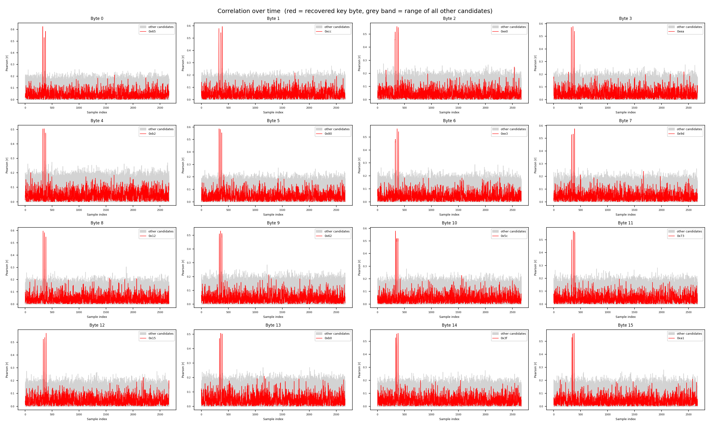
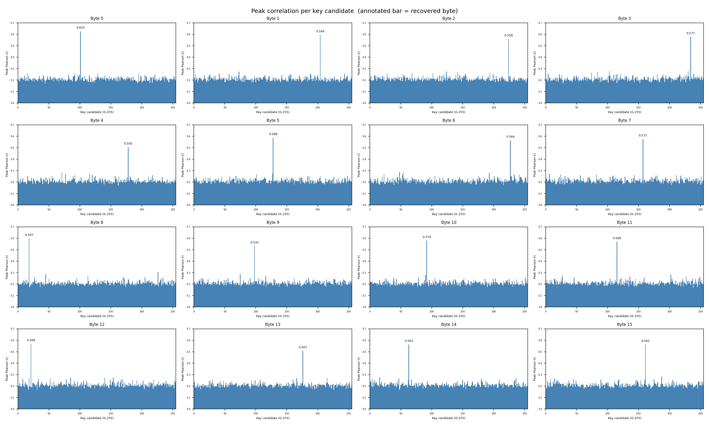
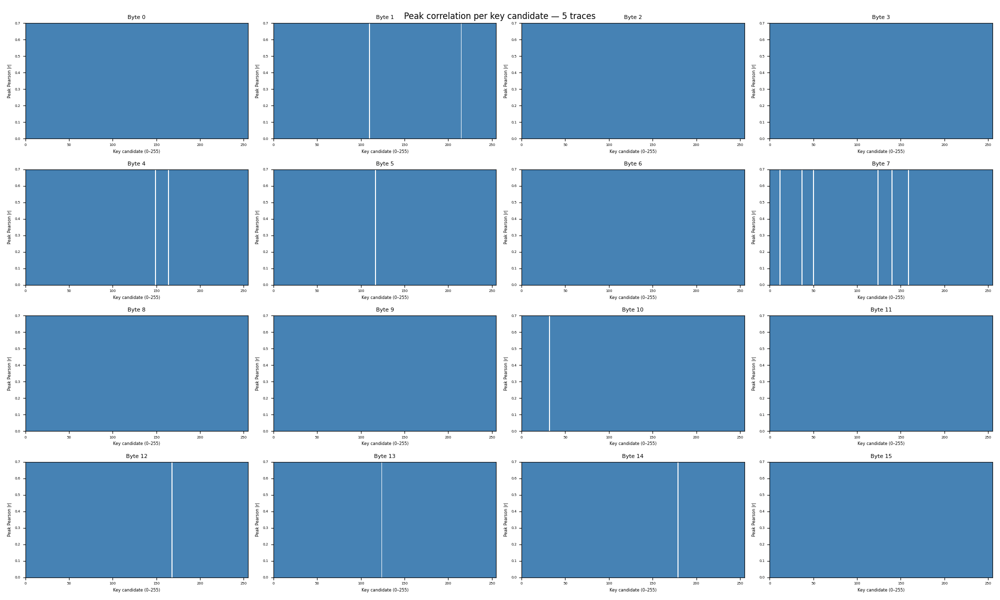

# PowerAnalysis: Part 1

## Summary

Challenge description: This embedded system allows you to measure the power consumption of the CPU while it is running an AES encryption algorithm. Use this information to leak the key via dynamic power analysis.

The challenge exposes a server that encrypts arbitrary 16-byte plaintexts with a fixed unknown AES-128 key and returns a power trace — a sequence of 2666 power measurements sampled during the encryption. By collecting many traces with random plaintexts and applying a **Correlation Power Analysis (CPA)** attack targeting the first SubBytes operation, the 16-byte key can be recovered one byte at a time.

**Artifacts:**

- `description.md`: original challenge description
- `solve.py`: Python script implementing the full CPA attack
- `run.npz`: 300 collected power traces and their corresponding plaintexts
- `plots/correlation_time.png`: Pearson correlation over time for each recovered key byte
- `plots/peak_correlation.png`: Peak correlation per key candidate for each byte
- `plots/peak_correlation.gif`: Animation of peak correlation building up over collected traces

## Context

The server accepts a 32-character hex-encoded plaintext over TCP and responds with a Python list representing the power trace of the AES encryption:

```
Please provide 16 bytes of plaintext encoded as hex: <hex>
power measurement result:  [76, 122, 123, ...]
```

Each power measurement is an integer proportional to the instantaneous power draw of the CPU at that clock cycle. The key remains fixed across all queries. The challenge hint states that noise is present in the traces, meaning a single trace is insufficient — multiple traces with varied plaintexts are required to average out the noise through correlation.

## Vulnerability

AES-128 begins each encryption with the following two operations applied independently to each of the 16 state bytes:

1. **AddRoundKey**: `state[i] = plaintext[i] XOR key[i]`
2. **SubBytes**: `state[i] = SBOX[plaintext[i] XOR key[i]]`

The power consumed when the CPU processes byte $i$ is correlated with the Hamming weight of the SubBytes output:

$$P_i \propto \text{HW}(\text{SBOX}[\text{plaintext}[i] \oplus \text{key}[i]])$$

Since we control `plaintext[i]` and can query as many traces as we like, this allows us to attack each of the 16 key bytes independently. For each byte position, we need only brute-force 256 possible key values rather than the full $2^{128}$ AES key space — reducing the attack to $16 \times 256 = 4096$ candidates total.

This vulnerability falls under [CWE-1300: Improper Protection of Physical Side Channels](https://cwe.mitre.org/data/definitions/1300.html).

## Exploitation

The attack is implemented in [solve.py](./solve.py) and proceeds in two phases.

### Phase 1 — Trace Collection

Random 16-byte plaintexts are sent to the server over parallel TCP connections, and the returned power traces are accumulated into a matrix of shape `(n_traces, n_samples)`. A live CPA estimate is updated after each trace arrives:

```python
def collect_one_trace(port, max_retries=8):
    for attempt in range(max_retries):
        try:
            with socket.socket(socket.AF_INET, socket.SOCK_STREAM) as sock:
                sock.connect((HOST, port))
                sock.settimeout(15)
                recv_until(sock, b"hex:")
                pt = os.urandom(16)
                sock.sendall(pt.hex().encode() + b"\n")
                response = recv_until(sock, b"]")
            start = response.index(b"[")
            end   = response.index(b"]") + 1
            return pt, ast.literal_eval(response[start:end].decode())
        except Exception:
            if attempt == max_retries - 1:
                raise
            time.sleep(0.5 * (attempt + 1))
```

### Phase 2 — Correlation Power Analysis

For each of the 16 key byte positions, a **hypothesis matrix** is computed — for every trace $i$ and every key candidate $k \in \{0, \ldots, 255\}$, the predicted power consumption is `HW(SBOX[plaintext[i][byte_pos] XOR k])`. This is computed fully vectorised using NumPy:

```python
xor = pt_arr[:, byte_pos, None] ^ np.arange(256, dtype=np.uint8)  # (n, 256)
hyp = HW[SBOX[xor]].astype(float)
```

The Pearson correlation between each column of the hypothesis matrix and each column of the trace matrix is then computed in a single matrix multiply:

```python
traces_c   = traces - traces.mean(axis=0)
traces_std = traces_c.std(axis=0)

hyp_c = hyp - hyp.mean(axis=0)
corr  = (hyp_c.T @ traces_c) / (n * np.outer(hyp_c.std(axis=0), traces_std) + 1e-12)
```

This yields a `(256, n_samples)` correlation matrix per byte. The key candidate with the highest peak absolute correlation across all time samples is selected as the recovered byte:

```python
peak   = np.abs(corr).max(axis=1)
best_k = int(peak.argmax())
```

The full `cpa_attack` function processes all 16 bytes:

```python
def cpa_attack(plaintexts, traces, verbose=False):
    n      = len(plaintexts)
    pt_arr = np.frombuffer(b"".join(plaintexts), dtype=np.uint8).reshape(n, 16)

    traces_c   = traces - traces.mean(axis=0)
    traces_std = traces_c.std(axis=0)

    key = []
    for byte_pos in range(16):
        xor    = pt_arr[:, byte_pos, None] ^ np.arange(256, dtype=np.uint8)
        hyp    = HW[SBOX[xor]].astype(float)
        hyp_c  = hyp - hyp.mean(axis=0)
        corr   = (hyp_c.T @ traces_c) / (n * np.outer(hyp_c.std(axis=0), traces_std) + 1e-12)
        peak   = np.abs(corr).max(axis=1)
        best_k = int(peak.argmax())
        key.append(best_k)
        if verbose:
            tqdm.write(f"   byte {byte_pos:2d}: 0x{best_k:02x}  (peak |r| = {peak[best_k]:.4f})")

    return bytes(key)
```

### Results

With 300 traces the correct key byte is decisively recovered for all 16 positions. The **correlation over time** plot shows that each byte produces a cluster of three closely-spaced correlation spikes, all corresponding to pipeline stages of the SubBytes table lookup: the SBOX output value `SBOX[pt[i] XOR key[i]]` moves across the data bus in multiple distinct clock-cycle events — fetched from the lookup table into a register, propagated through the pipeline, and written back to the state array — each producing an independent power spike correlated with `HW(SBOX[pt[i] XOR key[i]])`.



The **peak correlation** plot confirms that the correct key candidate stands clearly above all 255 wrong candidates for every byte, with peak |r| values well above the noise floor.



The animated GIF shows how the correct bar gradually separates from the noise as more traces are accumulated:



## Remediation

The root cause is that the server reveals physical side-channel information (power consumption) alongside its cryptographic output. Mitigations include:

- **Masking**: XOR all intermediate values with a fresh random mask before processing and unmask afterward. This decorrelates the Hamming weight of the processed data from the secret key, breaking the CPA model.
- **Hiding**: Introduce random delays or dummy operations to desynchronise power traces across encryptions, making trace alignment and correlation infeasible.
- **AES hardware accelerators**: Use accelerators with built-in side-channel countermeasures rather than software implementations.
